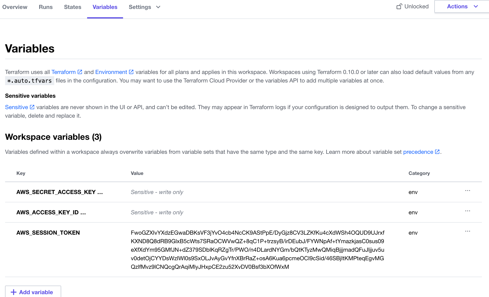
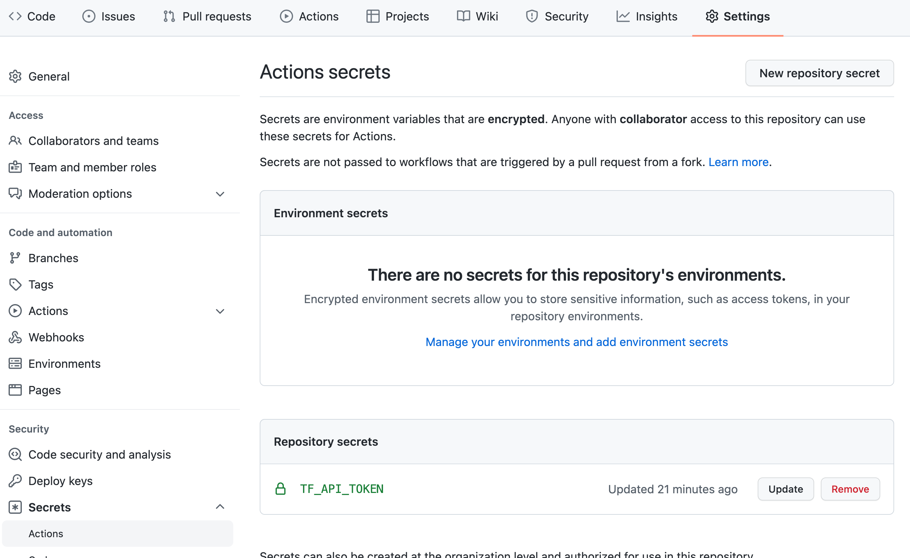

# Automate Terraform with GitHub Actions

GitHub Actions add continuous integration to GitHub repositories to automate your software builds, tests, and deployments. Automating Terraform with CI/CD enforces configuration best practices, promotes collaboration and automates the Terraform workflow.

The workflow will:

1. check whether the configuration is formatted properly to demonstrate how you can enforce best practices
2. generate a plan for every pull requests
3. apply the configuration when you update the main branch

Then, you will create and merge a pull request to test the workflow.

Terraform Cloud's built-in support for GitHub webhooks can accomplish this generic workflow. By performing the run from an Actions workflow, you can customize the workflow by adding additional steps before or after your Terraform commands.

## »Prerequisites
The Lab assumes that you are familiar with the Terraform and Terraform Cloud plan/apply workflows. If you're new to Terraform itself, refer first to the Getting Started tutorials. If you are new to Terraform Cloud, refer to the Get Started - Terraform Cloud tutorials.

For this Lab, you will need:

* A GitHub account 
* A Terraform Cloud account [https://app.terraform.io]
* An AWS account and AWS Access Credentials and AWS Session Token

## »Set up Terraform Cloud
The GitHub Action you create will connect to Terraform Cloud to plan and apply your configuration. Before we set up the Actions workflow, you must create a workspace, add your AWS service credentials to your Terraform Cloud workspace, and generate a user API token.

1. Go to Terraform Cloud  [https://app.terraform.io] 
2. Create a new workspace "terraform-github"
3. 

Next, add the following as Environment Variables for your terraform-github workspace with their respective values from the access credentials file you downloaded from AWS earlier.

* AWS_ACCESS_KEY_ID
* AWS_SECRET_ACCESS_KEY
* AWS_SESSION_TOKEN 

Mark all of these values as sensitive. Terraform Cloud will use these credentials to authenticate to AWS. You will see something similar to the image below.

* 

Finally, go to the Tokens page in your Terraform Cloud User Settings. Click on "Create an API token" and generate an API token named GitHub Actions. [https://app.terraform.io/app/settings/tokens?utm_source=learn]

Save this token in a safe place. You will add it to GitHub later as a secret, so the Actions workflow can authenticate to Terraform Cloud.

* 

## Set up a GitHub Respository
Next fork the following guide [https://github.com/TELE36058-Software-Defined-Networks/exercise-terraform-github.git] to your repo

In your forked repository, navigate to "Settings" then "Secrets". Create a new secret named TF_API_TOKEN, setting the Terraform Cloud API token you created in the previous step as the value.

* 

## »Review Your Code and Actions workflow
Review the code and make the appropriate changes to your configuration:
1. Configure your Terraform Cloud Organziation
2. Configure your workspaces with the name you used
3. Inspect the github workflow

